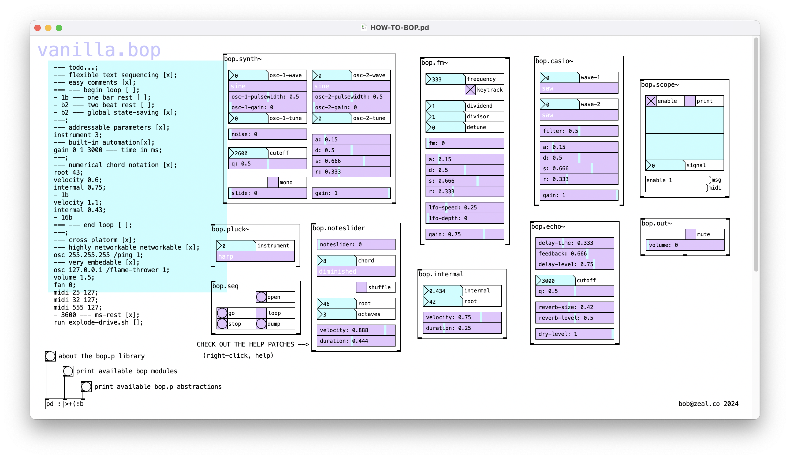

# bop 🐤

# ✨🦚 Friendly modules for Pure Data Vanilla 🦚✨

## what the bop? 🦜 
bop is a suite of music-making abstractions for the media programming environment [Pure Data](puredata.info/).  It is designed to be flexible, user-friendly, and fun.  It can be run on old hardware, embedded into Raspberry Pi projects, or be deployed at massive scale in distributed, immersive installations.

It is currently in pre-release and has the following features:

🐦 vanilla compatibility  
🐦 state-saving  
🐦 global parameter messaging with built-in automation  
🐦 powerful, esoteric musical notation  
🐦 fun and easy scripting language  
🐦 live coding capabilities  
🐦 unix-porn styling  

## Credits
bop makes use of some of [these](https://github.com/MikeMorenoDSP/pd-mkmr) superb abstractions by [Mike Moreno](https://mikemorenodsp.github.io/).