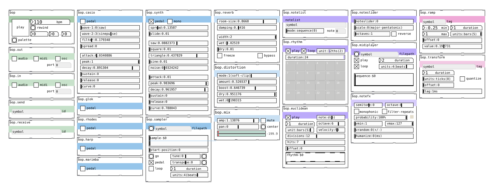

# bop 🐦
## for Pure Data

**Want to try it?**  I recommend starting with the [bop-starter](https://github.com/zealtv/bop-starter) template patch.

*bop* is a suite of modules for computer music composition in Pure Data.  It implements conventions of [Orac](https://github.com/TheTechnobear/Orac) with the aim of being somewhat cross compatible down the line, though more focussed on composition than performance.  Modules should provide an easy to use GUI and state saving to *"make shit easy"* 🐦. Currently it requires cyclone, eimguts, and freeverb.  Tested in Purr Data but efforts are made for vanilla compatibility.

---

bop uses some fantastic abstractions from Mike Moreno's [pd-mkmr repository](https://github.com/MikeMorenoDSP/pd-mkmr).

